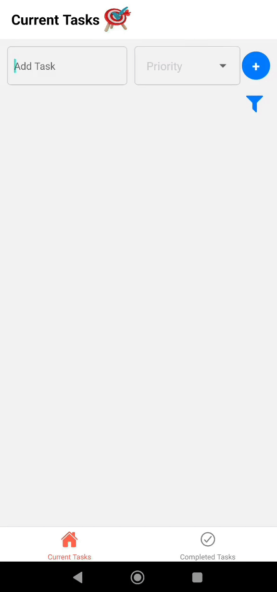
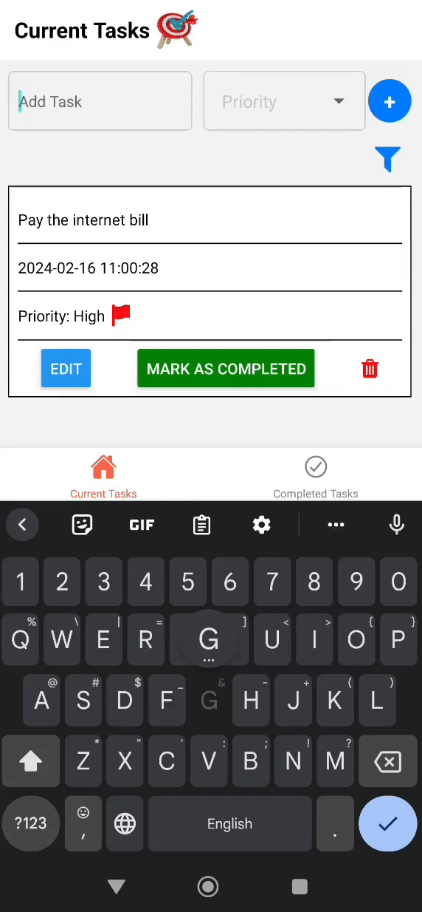
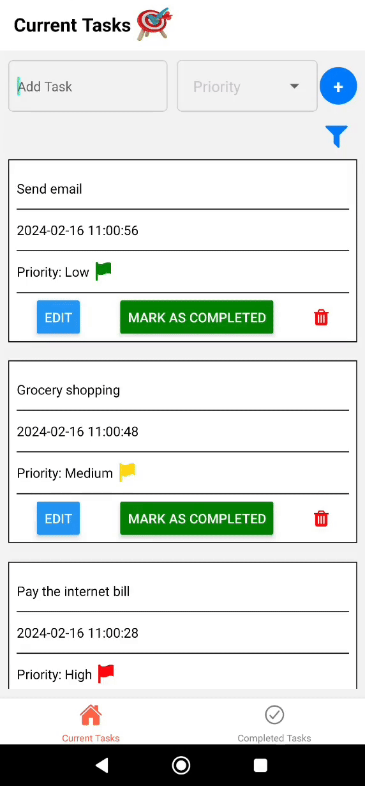

# DutyDart Task Manager App 🎯

DutyDart is a task manager application designed to help users organize their tasks efficiently. It is built using React-Native for cross-platform compatibility and utilizes Expo. Additionally, DutyDart employs SQLite for local database management, enabling users to store and manage their tasks seamlessly on their devices.

## Demo

   &nbsp;&nbsp;&nbsp;&nbsp;
   &nbsp;&nbsp;&nbsp;&nbsp;
  

